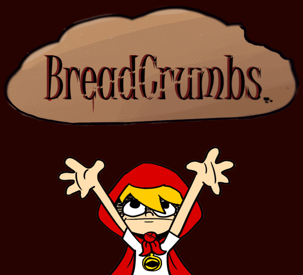
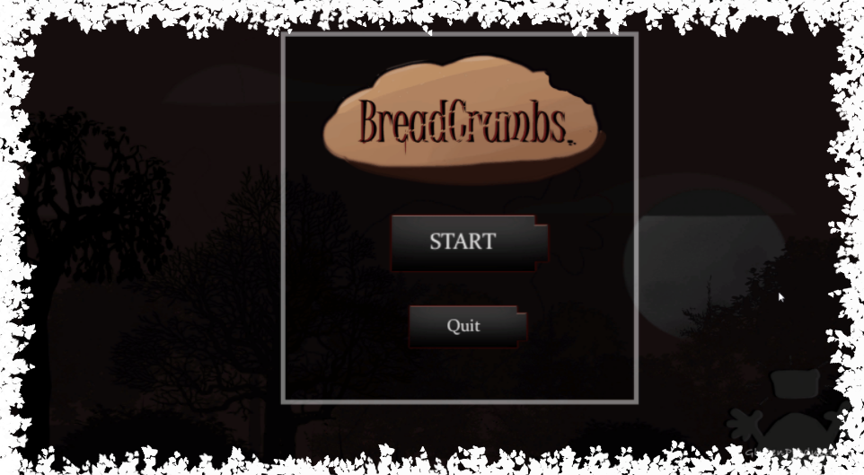
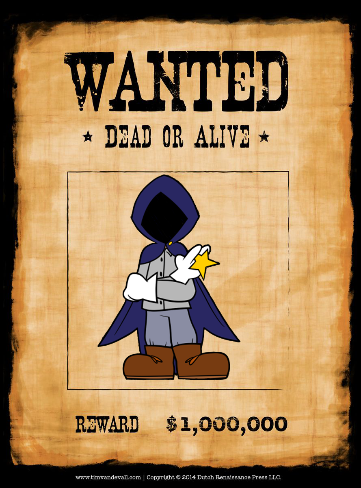

## About Me

  I'm a game programmer and enjoy writing and art. I'm proficient in C# and C++ from scratch and have completed projects in Unreal Engine 4 and Unity. 

  I was raised around technology and it was only a matter of time I dabbled into it as I was a student of David Thibodaux STEM Magnet Academy. In middle school I was in the robotics club. In high school I went down the technology field and went into digital media and was exposed to coding video games. This is when I knew I wanted to be a game programmer. Then in senior year a programming class opened up. Our teacher told us about a nation wide app challenge. So in 2019 I participated in the [2019 Congressional App Challenge](https://www.klfy.com/local/congressman-higgins-announces-winners-of-the-2019-congressional-app-challenge/) as a Graphic Designer. 

  By a miracle I found out about [AIE](https://aie.edu/) a technical college that teaches art and programming for games. This is where I start learning how to create games and begin to form connections.
  
## Games

### Bread Crumbs

  Bread Crumbs is an arcade-like, 3rd-person game that follows a character named Hoody. As Hoody, your job is to gather as many crumbs as possible while avoiding whatever may lurk in the dark. You will be exploring the Forest of Gluttony with a limited field of vision. The only way to survive is to evade, but no worries! You may find advantages in unexpected places.

* [Itchio Page](https://gluttonproductions.itch.io/bread-crumbs)
* Repo

### Rogue Star

  You will be playing as Rogue Star and trying to gather treasures while not getting caught. Your small figure helps allow you to get into small nooks and crannies but unfortunately, it's a disadvantage against the brutes that tower over you so fighting is no option. You can only avoid them and hope you won't make a scene.
  
* [Itchio Page](https://liquid-moon-productions.itch.io/rogue-star)
* [Youtube](https://www.youtube.com/watch?v=eMQXlPkYybM)

## Links

* [Resume](https://github.com/CaileyBianchini/CaileyBianchini/blob/main/GamePrograming_Resume_CaileyBianchini.pdf)
* [Linkdin](https://www.linkedin.com/in/cailey-bianchini-9517081ba/)
* [Itchio]([https://caileyb.itch.io/](https://caileybianchini.itch.io/))
* [Facebook](https://www.facebook.com/profile.php?id=100079209101080)

## Contact

* [Facebook](https://www.facebook.com/profile.php?id=100079209101080)
* [Cailey#2567 Discord](https://discord.com/)
* cailey.m.bianchini@gmail.com
