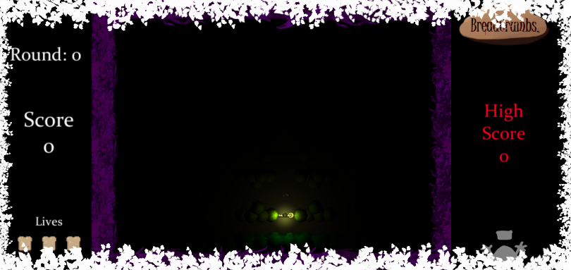
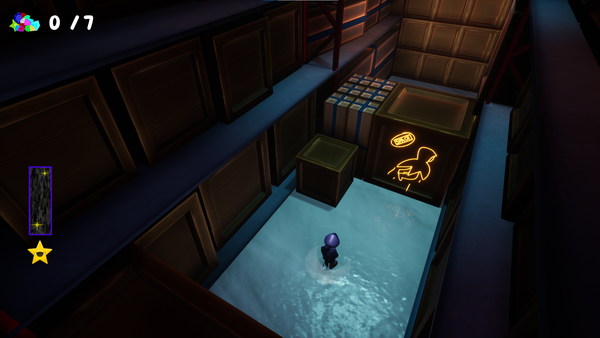

## About Me

  I'm a game programmer and enjoy writing and art. I'm proficient in C# and C++ from scratch and have completed projects in Unreal Engine 4 and Unity. 

  Since I was a student at David Thibodaux STEM Magnet Academy, it was only a matter of time before I started dabbling in technology. I was in the robotics club in middle school. While in high school, I studied digital media and was exposed to coding video games. It was then that I knew I wanted to become a game programmer. In my senior year, a programming class became available. And in 2019, I participated in the [2019 Congressional App Challenge](https://www.klfy.com/local/congressman-higgins-announces-winners-of-the-2019-congressional-app-challenge/) as a Graphic Designer. 

  By a miracle I found out about [AIE](https://aie.edu/) a technical college that teaches art and programming for games. This is where I start learning how to create games and begin to form connections.
  
## Games

### Bread Crumbs

  In this project I created player's movement, a light power up, and packaged the project properly. I also created the documentation and Readme for the game. We used Github, Gitkraken, and Unity to create this project and allow each other to see other's works

* [Itchio Page](https://gluttonproductions.itch.io/bread-crumbs)
* [Repo](https://github.com/NicholasPhJordan/BreadCrumbs)

### Rogue Star

  In this project I created the Enemy AI, the Stealth UI and was the head of the SFX. We used Preforce to be able to share and few eachothers works and combine them and the project was made in Unreal Engine 4.

  
* [Itchio Page](https://liquid-moon-productions.itch.io/rogue-star)
* [Youtube](https://www.youtube.com/watch?v=eMQXlPkYybM)

## Links

* [Resume](https://resume.creddle.io/resume/jk0a9153nfc)
* [Linkdin](https://www.linkedin.com/in/cailey-bianchini-9517081ba/)
* [Itchio](https://caileybianchini.itch.io/)
* [Facebook](https://www.facebook.com/profile.php?id=100079209101080)

## Contact

* [Facebook](https://www.facebook.com/profile.php?id=100079209101080)
* [Cailey#2567 Discord](https://discord.com/)
* cailey.m.bianchini@gmail.com
